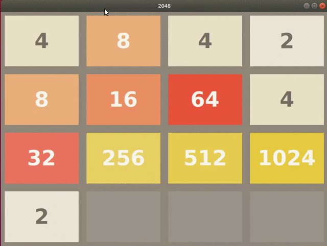

# 2048 A Deep Q-Learning-Approach
Project for the Machine Learning course - La Sapienza Università di Roma

Implementing an agent for the 2048 game using a reinforcement learning approach. 

Requirements 
* tensorflow==1.14.0
* keras-rl
* keras==2.2.0
* gym
* matplotlib
* pandas 
* numpy

Graphic Interface: visualize=True in test/fit

Evaluation:
